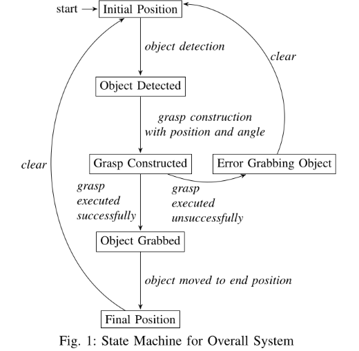
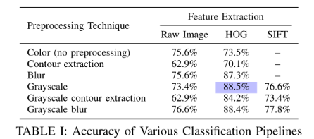

# Grasping model for a MICO robot arm

| Item          | URI                                        |
|:--------------|:-------------------------------------------|
| Report        | [`./report/grasp_1_final_report.pdf`](./report/grasp_1_final_report.pdf) |
| ROS Setup | [`./pas/README`](./pas/README) |
| Classifier | [`./angle_classifier`](./angle_classifier) |
| Data | [`./angle_classifier/data/`](./angle_classifier/data/) |

https://github.com/user-attachments/assets/2355c274-c054-4be8-883e-b5af4a8900a3

## Overview
This project implements a grasping model for the MICO robotic arm using the Robot
Operating System ecosystem (ROS). Aside from the real-world setup, the system was also developed and tested using a simulation. RViz and Gazebo were the tools used to interact and view this environment.

The system is designed to detect and grasp boxes placed at various angles and relocate them to a designated collection area.

The workflow includes:

* Creating a custom dataset, split into training and testing sets.
* Developing a perception pipeline to:
  1. Detect the target box,
  2. Classify its orientation using a Support Vector Machine (SVM) angle classifier,
  3. Compute an appropriate grasp based on the object's position and orientation.
* The final grasp command is transmitted to the MICO arm, which then executes the motion to complete the task.

-----

<figure>
  
</figure>

-----

The primary point of research is the comparison of the accuracy of the various classification methods. There were a variety of possible preprocessing steps and feature extraction possibilities that were tested.

The preprocessing steps that were tested are as follows:

-----

<figure>
  
</figure>

-----

The most-accurate classification pipeline was the pipeline which consisted of grayscaling the image as the preprocessing step and extracting the Histogram of Oriented Gradients as the feature extraction step. On the testing data-set (consisting of single boxes at various angles) this pipeline operated at 88.5% accuracy.
